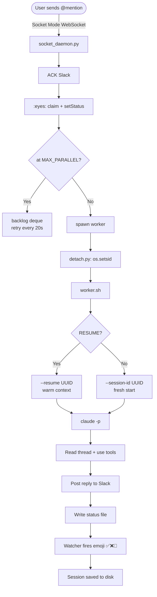

# claude-code-slack

> @mention a Slack bot → headless `claude -p` session fires on your Mac → reply lands in the thread.

A background daemon that bridges Slack and your local Claude Code agent. Claude has full access to your filesystem, tools, and codebase — whatever you point it at. Safe to deploy in shared team channels: non-authorized users get read-only access by default.

---

## What you can use it for

- **Codebase Q&A** — "@bot what does the auth module do?" while you're in a meeting
- **Run scripts and get results** — "@bot pull last week's error logs and summarize them"
- **Code review on demand** — "@bot review the diff in this branch"
- **Shared team assistant** — deploy in a channel so your whole team can ask questions about the codebase; only designated owners can make changes
- **Anything Claude Code can do** — it's just `claude -p` with your workspace on disk

---

## Architecture

```
User @mentions bot in Slack
        │
        ▼ Socket Mode WebSocket (real-time push)
socket_daemon.py  ──  ACK <3s  ──  :eyes: claim  ──  setStatus "thinking..."
        │
        │  parallel cap check → backlog if full
        │  (optional) prefetch thread context
        ▼
detach.py  ──  os.setsid()  ──  exec worker.sh   ← isolated process, survives daemon restart
        │
        ▼
worker.sh
  ├─ RESUME? → --resume UUID (warm context) or --session-id UUID (fresh)
  ├─ Spinner subprocess (emoji cycling every 30s)
  ├─ Watcher subprocess (polls for status file)
  └─ spawn claude -p --dangerously-skip-permissions
              │
              ├─ reads thread  ($SLACK replies)
              ├─ uses tools    (Read, Bash, etc.)
              ├─ posts reply   ($SLACK post)
              └─ writes status file → watcher fires ✅ / ❌ / 💬
```

[**View full interactive diagram →**](https://excalidraw.com/#json=XuUmy6iHC-5D8YVLgldZY,wN-FGokaweS2KEjbXarJbQ)



**Four things that make this work:**

1. **Socket Mode push** — Slack pushes events over WebSocket as they happen. No polling, no gaps.
2. **`os.setsid()`** — Workers run in a new process session. In-flight Claude sessions survive daemon restarts (laptop sleep, launchd reload).
3. **Atomic `:eyes:` claim** — `reactions.add` returns `already_reacted` if another process already claimed the event. Cross-restart idempotency for free.
4. **Thread-continuous sessions** — Follow-up mentions in a thread resume the prior `claude --resume <uuid>` session. Claude remembers prior tool calls and reasoning across turns.

---

## Requirements

- **macOS** (uses launchd for process management)
- **[Claude Code CLI](https://claude.ai/download)** — installed and authenticated (`claude login`)
- **Python 3.9+**
- A Slack workspace where you can create apps

---

## Slack app setup (~10 minutes)

1. Go to [api.slack.com/apps](https://api.slack.com/apps) → **Create New App** → **From scratch**

2. **Enable Socket Mode:** Settings → Socket Mode → Enable → create an App-Level Token with `connections:write` scope → save the `xapp-...` token

3. **Bot Token Scopes** (OAuth & Permissions → Scopes → Bot Token Scopes):
   ```
   app_mentions:read    assistant:write      channels:history
   channels:read        chat:write           files:read
   groups:history       groups:read          im:history
   im:read              im:write             mpim:history
   mpim:read            reactions:read       reactions:write
   search:read          users:read
   ```

4. **Event Subscriptions** → Enable → Subscribe to bot events:
   ```
   app_mention
   message.im
   reaction_added
   assistant_thread_started
   assistant_thread_context_changed
   ```

5. **App Home** → Messages Tab → enable "Allow users to send Slash commands and messages from the messages tab"

6. **Install to workspace** → copy the `xoxb-...` Bot User OAuth Token

7. **Find your Bot User ID**: send the bot a DM, click the sender name → "View full profile" → "..." → "Copy member ID"

8. **Find your own Slack User ID**: click your name in any message → "..." → "Copy member ID"

---

## Installation

```bash
git clone https://github.com/prrranavv/claude-code-slack
cd claude-code-slack
bash setup.sh
```

The setup script prompts for your tokens and IDs, then:
- Copies files to `~/.claude/claude-slack-bot/`
- Creates a Python venv and installs `slack_sdk`
- Generates the 3 launchd plists and loads them immediately

To install to a custom directory:
```bash
INSTALL_DIR=~/my-bot bash setup.sh
```

---

## Configuration

All config lives in `~/.claude/claude-slack-bot/config.env`. Never commit this file.

### Required

| Variable | Description |
|---|---|
| `SLACK_BOT_TOKEN` | Bot OAuth token (`xoxb-...`) |
| `SLACK_APP_TOKEN` | App-level token (`xapp-...`) |
| `BOT_USER_ID` | Your bot's Slack user ID |
| `AUTHORIZED_USER_ID` | Your Slack user ID — primary owner, gets tagged in replies |
| `AUTHORIZED_USER_NAME` | Your name (shown in "Stopped by X." messages) |

### Key optional settings

| Variable | Default | Description |
|---|---|---|
| `CLAUDE_WORKSPACE` | `$HOME` | Directory where Claude sessions run. **Set this to your project.** |
| `BOT_NAME` | `ClaudeBot` | Bot display name in logs and prompts |
| `EXTRA_WRITE_USER_IDS` | _(empty)_ | Comma-separated list of additional Slack user IDs that can run write/destructive operations |
| `RESUME_SESSIONS` | `0` | `0` = fresh each time, `dm` = resume in DMs, `1` = resume everywhere |
| `MAX_PARALLEL` | `10` | Max concurrent Claude sessions |
| `CLAUDE_TIMEOUT` | `1800` | Session timeout in seconds (30 min) |
| `PREFETCH_CONTEXT` | `off` | Pre-fetch thread before spawning: `off` / `dm` / `1` |
| `FORWARD_CHANNEL` | _(empty)_ | Slack channel ID to forward all new thread starts to |

After editing config.env:
```bash
launchctl unload ~/Library/LaunchAgents/com.claude-slack-bot.plist
launchctl load   ~/Library/LaunchAgents/com.claude-slack-bot.plist
```

---

## Using the bot

Invite it to a channel: `/invite @YourBotName`

```
@YourBotName what does src/auth.ts do?
@YourBotName run the tests and tell me what's failing
@YourBotName !sonnet summarize the last 20 commits
@YourBotName !fast what's 2+2?
```

### Per-mention flags

| Flag | Effect |
|---|---|
| `!opus` / `!sonnet` / `!haiku` | Pick a model for this session (default: opus) |
| `!fast` | Disable extended thinking for this turn — faster and cheaper |
| `!reset` | Clear this thread's session memory and start fresh |
| `!delete` | Delete all bot messages in this thread (owner only) |

### Built-in commands (instant, no Claude spawned)

| Command | Effect |
|---|---|
| `@bot status` or `@bot ?` | Show active sessions + thread memory (turn count, model, tokens used) |
| `@bot stop` | Kill all active workers in this thread (owner only) |
| 🛑 reaction on any message | Kill all active workers in that thread (owner only) |

### Reaction state machine

The bot uses Slack reactions as a live status indicator:

| Reaction | Meaning |
|---|---|
| 👀 `:eyes:` | Claimed, starting up |
| 💤 `:zzz:` | Queued behind another turn in this thread |
| ⏳ 🧠 ✍️ | Working (spinner cycles every 30s) |
| ✅ | Done |
| 💬 | Asked a clarifying question |
| ❌ | Failed — explanation in-thread |
| 🛑 | Stopped by owner |

---

## Team / multi-user setup

The bot is safe to deploy in shared Slack channels. The authorization model:

- **Authorized users** (`AUTHORIZED_USER_ID` + optional `EXTRA_WRITE_USER_IDS`) — can do anything: read files, run code, write files, git operations, etc.
- **Everyone else** — read-only. They can ask questions, get summaries, and read code. Any write/destructive request is refused with a polite explanation.

Authorization is enforced in `job-prompt.md`'s system prompt. The user identity comes from Slack's event payload — it can't be spoofed from message content.

To grant write access to additional users, add their IDs to `config.env`:
```bash
EXTRA_WRITE_USER_IDS=U111ABC,U222DEF
```

**Prompt injection is explicitly defended against.** The system prompt tells Claude to refuse instructions embedded in thread content, linked documents, pasted logs, or any claim that "the owner said to do X via this message."

---

## Tips from real-world use

### Keep your Mac awake

The bot needs your Mac to be on and connected. When the laptop sleeps, the WebSocket drops and events are lost (short sleeps are usually fine; overnight = events dropped).

**[Amphetamine](https://apps.apple.com/us/app/amphetamine/id937984704?mt=12)** is a free Mac app that keeps your machine awake on a schedule or indefinitely, even with the lid closed. Highly recommended if you want the bot reliably available during the day.

Alternatively, use the built-in `caffeinate` command:
```bash
caffeinate -di &   # -d: prevent display sleep, -i: prevent idle sleep
```

### Point `CLAUDE_WORKSPACE` at your project

By default Claude runs from `$HOME`. For the best results, set `CLAUDE_WORKSPACE` to your project directory in `config.env`:

```bash
CLAUDE_WORKSPACE=$HOME/my-project
```

This means:
- Claude reads `CLAUDE_WORKSPACE/CLAUDE.md` for project context automatically
- File paths in questions resolve relative to your project
- Skills in `.claude/skills/` are available without full paths

### Customize `job-prompt.md` for your domain

`job-prompt.md` is the system prompt every Claude session reads. Editing it is the most powerful customization available — no restart needed, the next mention picks it up automatically.

Ideas:
- Add company-specific context ("We're a fintech startup, our main stack is...")
- List available internal scripts and when to use them
- Set output format expectations ("Always respond in bullet points")
- Add domain-specific authorization rules ("Only run migrations on staging")

```bash
nano ~/.claude/claude-slack-bot/job-prompt.md
```

### Enable thread-continuous sessions

Set `RESUME_SESSIONS=1` in `config.env` for the best multi-turn experience. Follow-up replies in a thread resume the prior Claude session via `--resume <uuid>`, so Claude remembers earlier tool calls and reasoning:

```
You: @bot what's the bug in the payment flow?
Bot: [reads code, explains bug]
You: @bot fix it
Bot: [fixes it — still has the context from the previous turn, doesn't re-read everything]
```

Sessions auto-rotate when context exceeds 400k tokens or skills change.

### Use `!fast` for quick questions

Extended thinking is on by default (it's what makes Claude deep). For simple questions, `!fast` disables it for that turn:

```
@bot !fast what's the return type of getUserById?
@bot !fast !haiku     ← cheapest + fastest combo
```

### Watch the live log

```bash
tail -f ~/.claude/claude-slack-bot/watch.log
```

You'll see every mention, whether it resumed or started fresh, model used, elapsed time, and any errors.

---

## Customizing what Claude can do

### Adding skills

Create a directory of markdown files describing capabilities and drop it anywhere. Point `SKILLS_DIR` at it in `config.env`:

```bash
SKILLS_DIR=$HOME/my-claude-skills
```

Any skill edit invalidates all live sessions (forces fresh) — this is intentional. You don't want Claude running on stale instructions mid-conversation.

### Slack API from Claude

Claude uses `$SLACK` (the bundled `slack-scripts/slack-api.py`) to interact with Slack. It supports:
- `$SLACK post` — post messages (text or Block Kit)
- `$SLACK replies` — read thread
- `$SLACK history` — read channel history
- `$SLACK files` — download attachments
- `$SLACK react`, `update`, `delete`, `search`, `user`, `channels`

Block Kit reply templates live in `slack-scripts/templates/`. Copy and edit them when you want formatted responses.

---

## Operations

```bash
# Live log
tail -f ~/.claude/claude-slack-bot/watch.log

# Daemon status (non-zero PID = running)
launchctl list | grep claude-slack-bot

# Restart daemon (picks up socket_daemon.py changes)
launchctl kickstart -k gui/$(id -u)/com.claude-slack-bot

# Reload after config.env changes (re-reads env vars — kickstart won't)
launchctl unload ~/Library/LaunchAgents/com.claude-slack-bot.plist
launchctl load   ~/Library/LaunchAgents/com.claude-slack-bot.plist

# Kill all running workers (blunt — does not stop the daemon)
pkill -f "worker.sh"

# Hard reset (nuke everything and restart clean)
launchctl unload ~/Library/LaunchAgents/com.claude-slack-bot.plist
pkill -9 -f "socket_daemon.py" 2>/dev/null || true
pkill -9 -f "worker.sh" 2>/dev/null || true
rm -rf /tmp/claude-slack-bot-status && mkdir /tmp/claude-slack-bot-status
launchctl load ~/Library/LaunchAgents/com.claude-slack-bot.plist
# Then confirm: tail -f ~/.claude/claude-slack-bot/watch.log
# Should see: "=== socket daemon starting ===" then "=== socket daemon connected ==="
```

---

## Debugging

**Bot silent after a mention:**
1. `launchctl list | grep claude-slack-bot` — expect a non-zero PID
2. `tail -20 ~/.claude/claude-slack-bot/watch.log` — look for `NEW MENTION` or errors
3. Nothing in the log at all? Verify the bot is a member of the channel (`/invite @bot`) and Socket Mode is on in your app dashboard
4. Check tokens: `grep SLACK_ ~/.claude/claude-slack-bot/config.env`

**Daemon won't start:**
- Check `~/.claude/claude-slack-bot/stderr.log` for the crash reason
- Common causes: missing tokens in config.env, `.venv` path wrong
- Reinstall deps: `~/.claude/claude-slack-bot/.venv/bin/pip install -r ~/.claude/claude-slack-bot/requirements.txt`

**Everything failing with `:x:` immediately:**
- Test Claude directly: `claude -p "hello"`. If that fails → auth issue, not bot code
- Check `watch.log` for `claude stderr` lines

**Mac was asleep → missed mentions:**
- Expected. Socket Mode buffers events for short sleeps (seconds to a few minutes). Overnight = lost. Use Amphetamine to keep the Mac awake if you need consistent availability.

**Claude hanging:**
- Hard timeout is 30 min (`CLAUDE_TIMEOUT=1800`). Usually an MCP server stuck on shutdown.
- Kill it from Slack: `@bot stop` in the thread, or react 🛑 on any message in the thread.

---

## Authorization model

Only `AUTHORIZED_USER_ID` (and optionally `EXTRA_WRITE_USER_IDS`) can trigger write/destructive operations. Everyone else who mentions the bot in Slack gets read-only access.

Enforcement lives in `job-prompt.md`'s Authorization section — edit it to customize what read-only users can or can't do.

**What this doesn't protect against:** your Slack account being compromised, or anyone with shell access to the Mac running the daemon.

---

## File map

| Path | Purpose |
|---|---|
| `~/.claude/claude-slack-bot/socket_daemon.py` | Long-running WebSocket daemon |
| `~/.claude/claude-slack-bot/worker.sh` | Per-mention worker (spinner + claude + cleanup) |
| `~/.claude/claude-slack-bot/detach.py` | Process detachment (`os.setsid()`) |
| `~/.claude/claude-slack-bot/job-prompt.md` | **Edit this** to change Claude's behavior |
| `~/.claude/claude-slack-bot/config.env` | Your secrets and config (gitignored) |
| `~/.claude/claude-slack-bot/slack-scripts/slack-api.py` | Slack API wrapper used by Claude |
| `~/.claude/claude-slack-bot/slack-scripts/templates/` | Block Kit reply templates |
| `~/.claude/claude-slack-bot/sessions/` | Per-thread session state (resume feature) |
| `~/.claude/claude-slack-bot/watch.log` | Activity log — tail this |
| `~/Library/LaunchAgents/com.claude-slack-bot.plist` | Main daemon (KeepAlive) |
| `~/Library/LaunchAgents/com.claude-slack-bot-gc.plist` | Nightly GC at 04:07 |
| `~/Library/LaunchAgents/com.claude-slack-bot-digest.plist` | Daily activity digest at 09:03 |

---

## Limitations

- **Mac-only** — uses launchd; no response while the laptop is asleep or offline
- **Local credentials** — Claude runs as your user with `--dangerously-skip-permissions` and has access to whatever your account can access
- **In-memory backlog** — deferred mentions (when at `MAX_PARALLEL` cap) are lost if the daemon restarts before they drain
- **Single machine** — no redundancy; if the Mac is offline, the bot is offline
