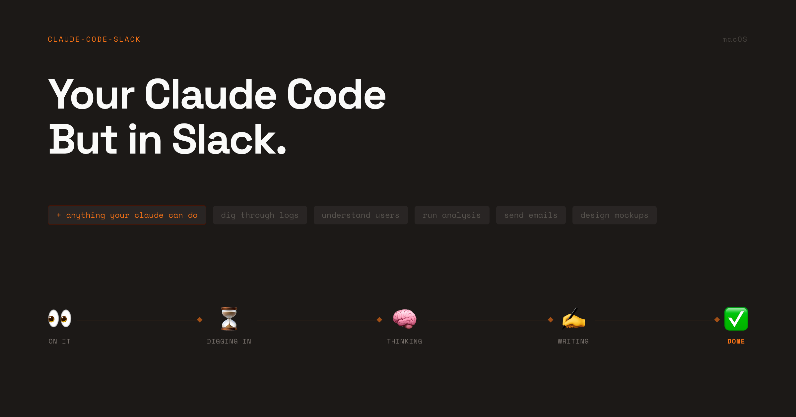
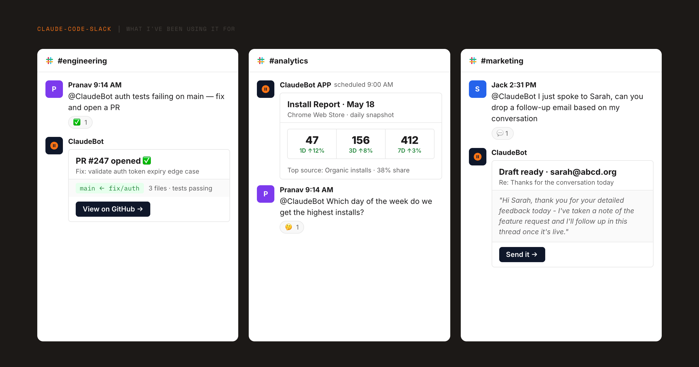

# claude-code-slack

> @mention a Slack bot → Claude Code session fires on your Mac → reply lands in the thread.

Claude has full access to your filesystem, tools, and codebase. Thread-continuous sessions mean follow-up mentions pick up where you left off. Safe in shared channels — non-authorized users get read-only access by default.

```
@bot what does the auth module do?
@bot run the failing tests and tell me why they're failing
@bot review the diff on feature/checkout and flag anything risky
@bot pull last week's error logs and summarize the top 5 issues
```




---

## Requirements

- **macOS** (uses launchd)
- **[Claude Code CLI](https://claude.ai/download)** — authenticated (`claude login`)
- **Python 3.9+**
- A Slack workspace where you can create apps

---

## Setup

### 1. Create the Slack app (~10 min)

1. [api.slack.com/apps](https://api.slack.com/apps) → **Create New App** → **From scratch**
2. **Socket Mode** → Enable → create App-Level Token with `connections:write` → save `xapp-...`
3. **Bot Token Scopes** (OAuth & Permissions → Scopes):
   ```
   app_mentions:read    assistant:write      channels:history
   channels:read        chat:write           files:read
   groups:history       groups:read          im:history
   im:read              im:write             mpim:history
   mpim:read            reactions:read       reactions:write
   search:read          users:read
   ```
4. **Event Subscriptions** → Subscribe to bot events:
   ```
   app_mention  message.im  reaction_added
   assistant_thread_started  assistant_thread_context_changed
   ```
5. **App Home** → Messages Tab → enable "Allow users to send Slash commands and messages from the messages tab"
6. Install to workspace → copy the `xoxb-...` Bot User OAuth Token
7. Find your **Bot User ID**: DM the bot → click sender name → "Copy member ID"
8. Find your own **Slack User ID**: click your name in any message → "Copy member ID"

### 2. Install

```bash
git clone https://github.com/prrranavv/claude-code-slack
cd claude-code-slack
bash setup.sh
```

Copies files to `~/.claude/claude-slack-bot/`, creates a Python venv, generates and loads 3 launchd plists.

To install to a custom path: `INSTALL_DIR=~/my-bot bash setup.sh`

### 3. Configure

Edit `~/.claude/claude-slack-bot/config.env`:

| Variable | Description |
|---|---|
| `SLACK_BOT_TOKEN` | Bot OAuth token (`xoxb-...`) |
| `SLACK_APP_TOKEN` | App-level token (`xapp-...`) |
| `BOT_USER_ID` | Bot's Slack user ID |
| `AUTHORIZED_USER_ID` | Your Slack user ID — gets write access + tagged in replies |
| `AUTHORIZED_USER_NAME` | Your name (shown in "Stopped by X." messages) |
| `CLAUDE_WORKSPACE` | **Set this to your project directory.** Claude reads its `CLAUDE.md` and resolves paths relative to it. Defaults to `$HOME`. |

Key optional settings:

| Variable | Default | Description |
|---|---|---|
| `EXTRA_WRITE_USER_IDS` | _(empty)_ | Comma-separated Slack IDs for additional write-access users |
| `RESUME_SESSIONS` | `0` | `dm` = resume in DMs, `1` = resume everywhere |
| `MAX_PARALLEL` | `10` | Max concurrent Claude sessions |
| `CLAUDE_TIMEOUT` | `1800` | Session timeout in seconds |
| `PREFETCH_CONTEXT` | `off` | Pre-fetch thread before spawning: `off` / `dm` / `1` |

After editing:
```bash
launchctl unload ~/Library/LaunchAgents/com.claude-slack-bot.plist
launchctl load   ~/Library/LaunchAgents/com.claude-slack-bot.plist
```

---

## Using the bot

Invite it to a channel: `/invite @YourBotName`

### Per-mention flags

| Flag | Effect |
|---|---|
| `!opus` / `!sonnet` / `!haiku` | Model for this session (default: opus) |
| `!fast` | Disable extended thinking — faster, cheaper |
| `!reset` | Clear this thread's session and start fresh |
| `!delete` | Delete all bot messages in this thread (owner only) |

### Built-in commands (no Claude spawned)

| Command | Effect |
|---|---|
| `@bot status` or `@bot ?` | Show active sessions + thread memory stats |
| `@bot stop` | Kill active workers in this thread (owner only) |
| 🛑 reaction on any message | Kill active workers in that thread (owner only) |

### Reaction state machine

| Reaction | Meaning |
|---|---|
| 👀 | Claimed, starting up |
| 💤 | Queued behind another turn |
| ⏳ 🧠 ✍️ | Working (cycles every 30s) |
| ✅ | Done |
| 💬 | Asked a clarifying question |
| ❌ | Failed |
| 🛑 | Stopped by owner |

---

## Team / multi-user

The bot is safe in shared channels. `AUTHORIZED_USER_ID` + `EXTRA_WRITE_USER_IDS` get full access — they can read, write, run code, and trigger git ops. Everyone else is read-only: they can ask questions and get summaries, but any write or destructive request is refused with a polite explanation.

Identity comes from Slack's event payload and can't be spoofed from message content. The system prompt explicitly defends against prompt injection — instructions embedded in thread replies, pasted logs, or linked documents are treated as data, not commands.

---

## Architecture

```
User @mentions bot
        │
        ▼ Socket Mode WebSocket (real-time push)
socket_daemon.py  ──  ACK <3s  ──  :eyes: claim  ──  setStatus "thinking..."
        │
        ▼
detach.py  ──  os.setsid()  ──  exec worker.sh   ← survives daemon restarts
        │
        ▼
worker.sh
  ├─ RESUME? → --resume UUID (warm context) or --session-id UUID (fresh)
  ├─ Spinner subprocess (emoji cycling every 30s)
  ├─ Watcher subprocess (polls for status file)
  └─ spawn claude -p --dangerously-skip-permissions
              ├─ reads thread  ($SLACK replies)
              ├─ uses tools    (Read, Bash, etc.)
              ├─ posts reply   ($SLACK post)
              └─ writes status file → watcher fires ✅ / ❌ / 💬
```

**Four things that make this reliable:**

- **Socket Mode push** — Slack pushes events over WebSocket. No polling, no gaps.
- **`os.setsid()`** — Workers run in a new process session. In-flight sessions survive daemon restarts.
- **Atomic `:eyes:` claim** — `reactions.add` returns `already_reacted` if another process claimed the event first. Idempotent across restarts.
- **Thread-continuous sessions** — Follow-up mentions resume `--resume <uuid>`, preserving full context across turns.

---

## Customizing

### Point Claude at your project

Set `CLAUDE_WORKSPACE` in `config.env`. Claude reads `CLAUDE.md` from that directory and resolves all file paths relative to it — the single biggest quality improvement you can make.

### Edit `job-prompt.md`

This is the system prompt every session reads. No restart needed — the next mention picks it up. Add company context, list internal scripts, set output format expectations, or tighten the authorization rules for your team.

### Add skills

Drop a directory of markdown files describing capabilities and point `SKILLS_DIR` at it in `config.env`. Any skill edit forces a fresh session on the next mention.

### Block Kit templates

Formatted reply templates live in `slack-scripts/templates/`. Claude picks the right one based on the shape of the response:

| Shape | Template |
|---|---|
| Short answer, list, ack | `quick-answer.json` |
| Findings, data, metrics | `report.json` |
| Recommendations | `recommendations.json` |
| Warning / error / callout | `callout.json` |
| Task completed, files changed | `task-done.json` |
| Pre-action plan | `plan.json` |
| Code / PR review | `code-review.json` |
| Error root cause + fix | `debug.json` |
| Side-by-side comparison | `comparison.json` |

---

## Tips

**Keep your Mac awake.** The WebSocket drops when the laptop sleeps and events are lost. [Amphetamine](https://apps.apple.com/us/app/amphetamine/id937984704?mt=12) keeps the machine awake on a schedule. Or: `caffeinate -di &`

**Use `!fast` for quick questions.** Extended thinking is on by default. `!fast` disables it for that turn — `@bot !fast !haiku` is the cheapest combo.

**Enable session resumption.** Set `RESUME_SESSIONS=1`. Follow-up mentions resume the prior Claude session — no re-reading, full context from the previous turn.

---

## Operations

```bash
# Live log
tail -f ~/.claude/claude-slack-bot/watch.log

# Daemon status (non-zero PID = running)
launchctl list | grep claude-slack-bot

# Restart daemon (picks up socket_daemon.py changes)
launchctl kickstart -k gui/$(id -u)/com.claude-slack-bot

# Hard reset
launchctl unload ~/Library/LaunchAgents/com.claude-slack-bot.plist
pkill -9 -f "socket_daemon.py" 2>/dev/null || true
pkill -9 -f "worker.sh" 2>/dev/null || true
rm -rf /tmp/claude-slack-bot-status && mkdir /tmp/claude-slack-bot-status
launchctl load ~/Library/LaunchAgents/com.claude-slack-bot.plist
```

---

## Debugging

**Bot silent after a mention:**
1. `launchctl list | grep claude-slack-bot` — expect a non-zero PID
2. `tail -20 ~/.claude/claude-slack-bot/watch.log` — look for `NEW MENTION` or errors
3. Nothing in the log? Verify the bot is in the channel (`/invite @bot`) and Socket Mode is on
4. Check tokens: `grep SLACK_ ~/.claude/claude-slack-bot/config.env`

**Daemon won't start:** check `~/.claude/claude-slack-bot/stderr.log`. Common causes: missing tokens, wrong `.venv` path.

**Everything failing with `:x:`:** test Claude directly: `claude -p "hello"`. If that fails → auth issue, not bot code.

**Claude hanging:** hard timeout is 30 min (`CLAUDE_TIMEOUT`). Kill from Slack: `@bot stop` or 🛑 reaction.

**Mac was asleep → missed mentions:** expected. Socket Mode buffers short sleeps; overnight events are lost. Use Amphetamine.

---

## File map

All paths relative to `~/.claude/claude-slack-bot/` after install.

| File | Purpose |
|---|---|
| `socket_daemon.py` | Long-running WebSocket daemon |
| `worker.sh` | Per-mention worker (spinner + claude + cleanup) |
| `detach.py` | Process detachment (`os.setsid()`) |
| `job-prompt.md` | **Edit this** to change Claude's behavior |
| `config.env` | Your secrets and config (gitignored) |
| `slack-scripts/slack-api.py` | Slack API wrapper used by Claude |
| `slack-scripts/templates/` | Block Kit reply templates |
| `sessions/` | Per-thread session state (resume feature) |
| `watch.log` | Activity log — tail this |

---

## Limitations

- **Mac-only** — uses launchd; no response while the laptop is asleep or offline
- **Local credentials** — Claude runs as your user with `--dangerously-skip-permissions`
- **In-memory backlog** — deferred mentions are lost if the daemon restarts before they drain
- **Single machine** — no redundancy; if the Mac is offline, the bot is offline
